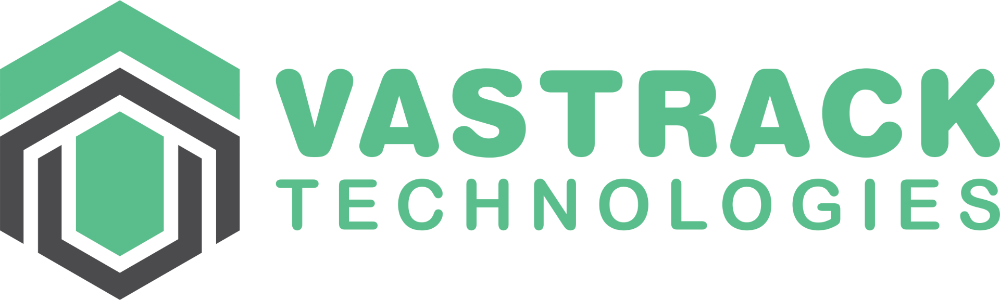

# 🚀 Vastracktech Technologies Website

> **Leading Nigeria's telecommunications revolution with innovative Value-Added Services since 2009**

A modern, responsive, and feature-rich website built for Vastracktech Technologies - Nigeria's premier VAS solutions provider offering SMS Gateway, USSD Services, IVR Solutions, and Mobile Payment platforms.



---

## 📋 Table of Contents

- [About Vastracktech](#-about-vastracktech)
- [Features](#-features)
- [Technology Stack](#-technology-stack)
- [Project Structure](#-project-structure)
- [Getting Started](#-getting-started)
- [Development](#-development)
- [Deployment](#-deployment)
- [Pages & Routes](#-pages--routes)
- [Components](#-components)
- [Styling & UI](#-styling--ui)
- [Assets & Media](#-assets--media)
- [API Integration](#-api-integration)
- [SEO & Performance](#-seo--performance)
- [Contributing](#-contributing)
- [License](#-license)
- [Contact](#-contact)

---

## 🏢 About Vastracktech

**Vastracktech Technologies** is a leading Nigerian telecommunications company providing comprehensive Value-Added Services (VAS) solutions. With over **15 years of excellence**, we serve **1000+ businesses** across Nigeria, processing **50+ million messages monthly** with **99.9% uptime**.

### 🎯 Our Services

- **📱 SMS Gateway** - Enterprise-grade messaging solutions
- **☎️ USSD Services** - Interactive mobile solutions
- **🎙️ IVR Solutions** - Automated voice response systems
- **💳 Mobile Payments** - Secure payment processing platforms
- **🏦 Banking Solutions** - Financial services integration
- **🏥 Health Services** - Healthcare technology solutions
- **🎓 Education Tools** - Digital learning platforms

---

## ✨ Features

### 🎨 Design & UX
- **Responsive Design** - Seamless experience across all devices
- **Modern UI/UX** - Clean, professional, and intuitive interface
- **Hero Backgrounds** - Stunning visuals for each page
- **Interactive Components** - Engaging user interactions
- **Accessibility** - WCAG compliant for inclusivity

### ⚡ Performance
- **Fast Loading** - Optimized for speed with Vite
- **Code Splitting** - Efficient bundle management
- **Image Optimization** - Responsive images and WebP support
- **SEO Optimized** - Search engine friendly structure

### 🔧 Functionality
- **Multi-page Application** - 20+ pages with React Router
- **Contact Forms** - Interactive contact and service inquiry forms
- **News & Media** - Dynamic content management
- **Documentation** - Comprehensive service documentation
- **Case Studies** - Real-world implementation examples

---

## 🛠 Technology Stack

### **Frontend Framework**
- **React 18.3.1** - Modern React with hooks and concurrent features
- **TypeScript 5.8.3** - Type-safe development
- **Vite 5.4.19** - Lightning-fast build tool and dev server

### **UI & Styling**
- **Tailwind CSS 3.4.17** - Utility-first CSS framework
- **Shadcn/UI** - High-quality component library built on Radix UI
- **Lucide React 0.462.0** - Beautiful icon library
- **CSS-in-JS** - Component-scoped styling

### **State Management & Forms**
- **React Hook Form 7.61.1** - Performant forms with easy validation
- **TanStack Query 5.83.0** - Powerful data synchronization
- **Zod 3.25.76** - TypeScript-first schema validation

### **Routing & Navigation**
- **React Router DOM 6.30.1** - Declarative routing for React

### **Development Tools**
- **ESLint 9.32.0** - Code linting and formatting
- **PostCSS 8.5.6** - CSS processing
- **Autoprefixer 10.4.21** - CSS vendor prefixing

---

## 📁 Project Structure

```
vastrack-clean/
├── 📁 public/                 # Static assets
│   └── robots.txt
├── 📁 src/
│   ├── 📁 components/         # Reusable UI components
│   │   ├── Header.tsx         # Navigation header
│   │   ├── Footer.tsx         # Site footer
│   │   ├── Hero.tsx           # Landing hero section
│   │   ├── Newsletter.tsx     # Email subscription
│   │   └── ui/                # Shadcn/UI components
│   ├── 📁 pages/              # Page components (20+ pages)
│   │   ├── Index.tsx          # Homepage
│   │   ├── About.tsx          # Company information
│   │   ├── Services.tsx       # Services overview
│   │   ├── Contact.tsx        # Contact page
│   │   ├── SmsGateway.tsx     # SMS services
│   │   ├── UssdServices.tsx   # USSD solutions
│   │   ├── IvrSolutions.tsx   # IVR systems
│   │   ├── MobilePayments.tsx # Payment solutions
│   │   └── ...               # Additional service pages
│   ├── 📁 assets/             # Static assets
│   │   ├── images/            # Image files (50+ images)
│   │   ├── icons/             # SVG icons collection
│   │   └── vastrack-logo.png  # Company logo
│   ├── 📁 hooks/              # Custom React hooks
│   ├── 📁 lib/                # Utility functions
│   ├── App.tsx                # Main app component
│   ├── main.tsx               # App entry point
│   └── index.css              # Global styles
├── 📄 package.json            # Dependencies and scripts
├── 📄 tailwind.config.ts      # Tailwind configuration
├── 📄 vite.config.ts          # Vite configuration
├── 📄 tsconfig.json           # TypeScript configuration
└── 📄 README.md               # This file
```

---

## 🚀 Getting Started

### Prerequisites

- **Node.js** (v18 or higher) - [Download here](https://nodejs.org/)
- **npm** or **yarn** package manager
- **Git** for version control

### Installation

1. **Clone the repository**
   ```bash
   git clone https://github.com/mazi-samuel/vastrack.com.ng.git
   cd vastrack-clean
   ```

2. **Install dependencies**
   ```bash
   npm install
   # or
   yarn install
   ```

3. **Start development server**
   ```bash
   npm run dev
   # or
   yarn dev
   ```

4. **Open in browser**
   ```
   http://localhost:8080
   ```

---

## 💻 Development

### Available Scripts

```bash
# Development server with hot reload
npm run dev

# Build for production
npm run build

# Build for development (with dev settings)
npm run build:dev

# Preview production build locally
npm run preview

# Run ESLint for code quality
npm run lint
```

### Development Server

The development server runs on `http://localhost:8080` with:
- ⚡ Hot Module Replacement (HMR)
- 🔍 TypeScript checking
- 🎨 Tailwind CSS compilation
- 📱 Mobile-responsive preview

---

## 🌐 Deployment

### Building for Production

```bash
# Create optimized production build
npm run build
```

This generates a `dist/` folder with:
- Minified JavaScript and CSS
- Optimized images and assets
- Static HTML files for each route

### Deployment Options

**Recommended Platforms:**
- **Vercel** - Zero-config deployment with automatic builds
- **Netlify** - Static site hosting with continuous deployment
- **GitHub Pages** - With GitHub Actions for automated builds
- **Firebase Hosting** - Google's hosting platform

**Manual Deployment:**
1. Run `npm run build`
2. Upload `dist/` folder contents to your hosting provider
3. Configure server for SPA routing (if needed)

### Multi-Repository Deployment

The project supports deployment to multiple repositories using the `push-all.ps1` script:

```powershell
# Push to all configured repositories
.\push-all.ps1
```

This pushes to:
- `origin` → `main` branch (vastrack.com.ng)
- `vastrack-tech` → `staging` branch (VastrackWeb)
- `clone-faithful` → `master` branch (vastrack-clone-faithful)

---

## 🗺 Pages & Routes

| Route | Component | Description |
|-------|-----------|-------------|
| `/` | Index.tsx | Homepage with hero and services overview |
| `/about` | About.tsx | Company information and values |
| `/services` | Services.tsx | Services overview |
| `/contact` | Contact.tsx | Contact form and information |
| `/sms-gateway` | SmsGateway.tsx | SMS services details |
| `/ussd-services` | UssdServices.tsx | USSD solutions |
| `/ivr-solutions` | IvrSolutions.tsx | IVR systems |
| `/mobile-payments` | MobilePayments.tsx | Payment solutions |
| `/banking-solutions` | BankingSolutions.tsx | Banking services |
| `/health-services` | HealthServices.tsx | Healthcare solutions |
| `/education-tools` | EducationTools.tsx | Educational platforms |
| `/vas-solutions` | VasSolutions.tsx | VAS solutions overview |
| `/our-approach` | OurApproach.tsx | Company methodology |
| `/resource-centre` | ResourceCentre.tsx | Documentation and resources |
| `/news-media` | NewsMedia.tsx | News and media coverage |
| `/case-studies` | CaseStudies.tsx | Implementation examples |
| `/partnership-models` | PartnershipModels.tsx | Business partnerships |
| `/technical-architecture` | TechnicalArchitecture.tsx | Technical details |
| `/ncc-documentation` | NCCDocumentation.tsx | Regulatory compliance |
| `/knowledge-hub` | KnowledgeHub.tsx | Knowledge base |

---

## 🧩 Components

### Core Components

- **Header.tsx** - Navigation with mobile responsiveness
- **Footer.tsx** - Site footer with contact information
- **Hero.tsx** - Landing page hero section
- **Newsletter.tsx** - Email subscription component

### Feature Components

- **CallToAction.tsx** - CTA sections
- **CoreSolutions.tsx** - Services showcase
- **Statistics.tsx** - Company statistics
- **Partners.tsx** - Partner logos
- **WhyChoose.tsx** - Value propositions
- **NewsMedia.tsx** - News and media content

### UI Components (Shadcn/UI)

Over 30 pre-built components including:
- Buttons, Cards, Forms
- Dialogs, Dropdowns, Tooltips
- Accordions, Tabs, Carousels
- Data tables, Charts, Progress bars

---

## 🎨 Styling & UI

### Design System

- **Primary Color:** `#5cbc8c` (Vastracktech Green)
- **Typography:** System fonts with Tailwind typography
- **Spacing:** Consistent 8px grid system
- **Breakpoints:** Mobile-first responsive design

### Tailwind Configuration

```typescript
// tailwind.config.ts
export default {
  content: ["./index.html", "./src/**/*.{js,ts,jsx,tsx}"],
  theme: {
    extend: {
      colors: {
        primary: "#5cbc8c",
        // ... additional custom colors
      }
    }
  }
}
```

### Component Variants

Built with `class-variance-authority` for consistent component APIs:

```typescript
const buttonVariants = cva(
  "inline-flex items-center justify-center rounded-md",
  {
    variants: {
      variant: {
        default: "bg-primary text-primary-foreground",
        cta: "bg-gradient-to-r from-primary to-primary-glow"
      }
    }
  }
)
```

---

## 📸 Assets & Media

### Images

- **50+ High-quality images** in `src/assets/images/`
- **Hero backgrounds** for each major page
- **Service illustrations** and diagrams
- **Team photos** and company images
- **Partner logos** (MTN, Airtel, Glo, 9Mobile)

### Icons

- **25+ Custom SVG icons** in `src/assets/icons/`
- **Lucide React icons** for UI elements
- **Service-specific icons** for features

### Image Optimization

- **WebP format** support for modern browsers
- **Responsive images** with proper sizing
- **Lazy loading** for performance

---

## 🔌 API Integration

### Form Handling

Contact and inquiry forms built with React Hook Form:

```typescript
const form = useForm<ContactFormData>({
  resolver: zodResolver(contactSchema),
  defaultValues: {
    firstName: "",
    lastName: "",
    email: "",
    message: ""
  }
})
```

### Data Fetching

Prepared for API integration with TanStack Query:

```typescript
const { data, isLoading } = useQuery({
  queryKey: ['services'],
  queryFn: fetchServices
})
```

---

## 🔍 SEO & Performance

### SEO Optimization

- **Meta tags** for each page
- **Open Graph** tags for social sharing
- **Structured data** for search engines
- **Semantic HTML** markup
- **XML sitemap** ready

### Performance Features

- **Code splitting** by route
- **Lazy loading** of components
- **Image optimization** and compression
- **Bundle analysis** tools
- **Web Vitals** optimization

### Accessibility

- **WCAG 2.1 AA** compliance
- **Keyboard navigation** support
- **Screen reader** compatibility
- **Color contrast** compliance
- **Focus management**

---

## 🤝 Contributing

### Development Workflow

1. **Fork** the repository
2. **Create** a feature branch (`git checkout -b feature/amazing-feature`)
3. **Commit** your changes (`git commit -m 'Add amazing feature'`)
4. **Push** to the branch (`git push origin feature/amazing-feature`)
5. **Open** a Pull Request

### Code Standards

- **TypeScript** for type safety
- **ESLint** for code quality
- **Prettier** for code formatting
- **Conventional commits** for clear history

### Testing

```bash
# Add tests for new features
npm run test

# Run type checking
npm run type-check
```

---

## 📄 License

This project is proprietary software owned by **Vastracktech Technologies**. All rights reserved.

---

## 📞 Contact

### Vastracktech Technologies

- **🌐 Website:** [vastracktech.com.ng](https://vastracktech.com.ng)
- **📧 Email:** tech@vastracktech.com.ng
- **📱 Phone:** +234(0)816-0443-352
- **📍 Address:** 4, Babatope Bejide Crescent, Lekki, Lagos, Nigeria

### Development Team

- **🔧 Technical Lead:** Samuel Mazi
- **💼 Project Manager:** Vastracktech PM Team
- **🎨 Design:** Vastracktech Design Team

---

### 🌟 **Built with ❤️ by Vastracktech Technologies**

*Transforming Nigeria's telecommunications landscape, one solution at a time.*